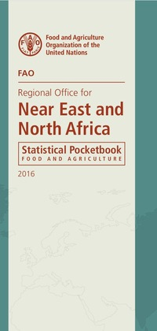



<!-- <iframe width="560" height="315" src="https://www.youtube.com/embed/IuXqK8-Isxc" frameborder="0" allowfullscreen></iframe> -->

## Browse html version

### 2016

<ul>

  
  
  

</ul>

### 2015

<ul>

  
  
  

</ul>

## Download pdf versions

### 2016

 

 

### 2015

<!--

  <h3>Recent updates</h3>

  <ul class="posts">
    
      <li>
        {{ post.date | date: "%b %-d, %Y" }}
        <a class="post-link" href="{{ post.url | prepend: site.baseurl }}">{{ post.title }}</a>
      </li>
    
  </ul>

  
subscribe <a href="{{ "/feed.xml" | prepend: site.baseurl }}">via RSS</a>

-->
